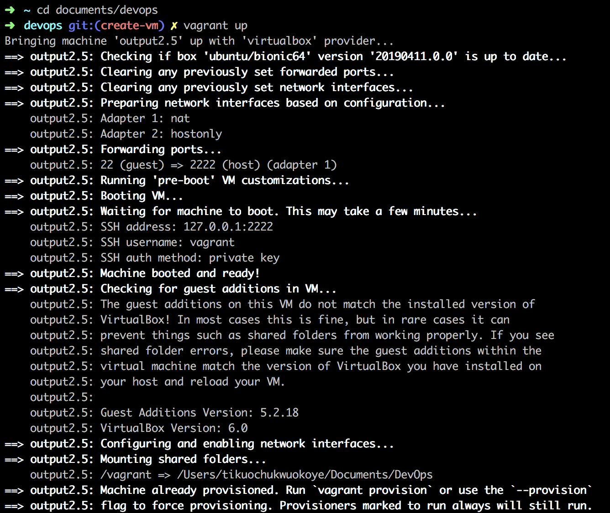
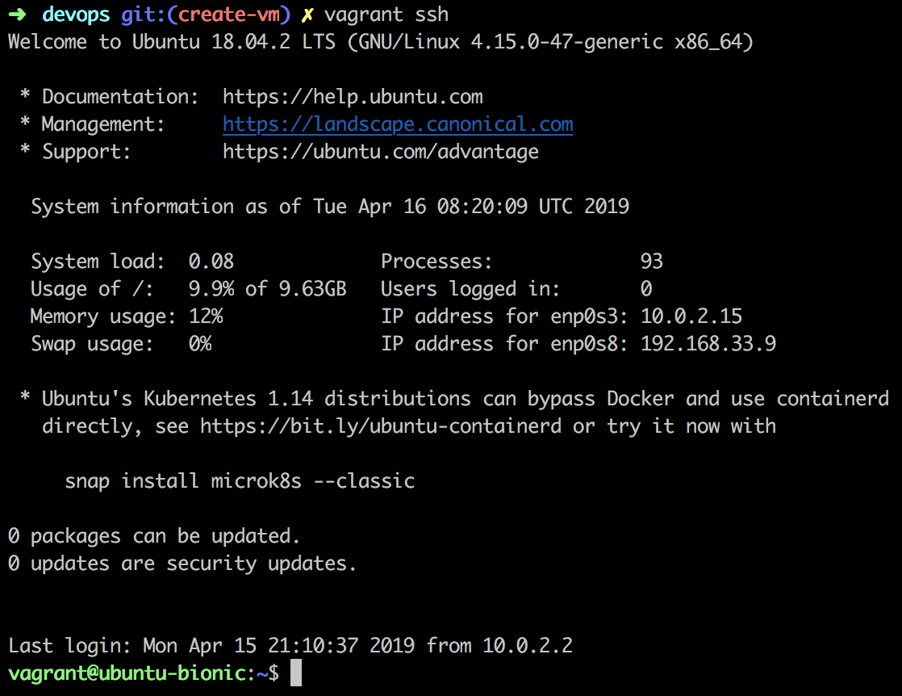

# Creating a Virtual machine
Creating a server will give you insights into how servers work and help you be successful any time you’re working with a server in the future.

## Prerequisites
- 1 A laptop/ desktop with at least 4gb RAM
- 2 Download and install Vagrant from [here](https://www.vagrantup.com/downloads.html)
- 3 Download and install Virtual box [here](https://www.virtualbox.org/wiki/Downloads)

To achieve this task, we would make use of vagrant. Vagrant is a tool for building and managing virtual machine environments in a single workflow. The virtual machine environments are provisioned on top of popular VM providers like VirtualBox, VMware, AWS, etc. Vagrant also has the functionality of using provisioning tools such as shell scripts, Chef, or Puppet, to automatically install and configure software on the virtual machine.
Vagrant uses a vagrantfile to describe the type of machine required for a project, and how to configure and provision these machines.

## Walkthrough of all the commands in the Vagarntfile
Taking a look at the vagrantfile in this repo, we see some commands in it. These are the commands that tell vagrant what kind of VM to build and what to do with it.

The `Vagrant.configure("2")` command specifies the version of the configuration object config that would be used for configuration. "2" represents the configuration for 1.1+ leading up to 2.0.x.
The settings within config.vm modify the configuration of the machine that Vagrant manages.

The `config.vm.box = "ubuntu/bionic64"` command configures what box the virtual machine will be brought up against; in this case an ubuntu bionic 64bit box. A box is a package format for vagrant environments.

The `config.vm.box_check_update = true` command tells vagrant to check for updates to the configured box on every vagrant up (command to create and configure the virtual machine according to our Vagrantfile).

The `config.vm.define "output2.5"` command defines the name of the virtual machine that vagrant would build.

`config.vm.network "forwarded_port", guest: 80, host: 8080, host_ip: "127.0.0.1"`. This command allows us access to port 8080 on localhost (127.0.0.1) on the host machine (physical machine) and forwards all traffic to port 80 on the guest machine (VM).

`config.vm.network "private_network", ip: "192.168.33.10"` sets a private IP address through which we can access the VM but because its a private IP address, it is not accessible to the public.

`config.vm.provision "shell", inline: <<-SHELL
  apt-get install -y apache2
 SHELL`


This last command is a shell command to install apache on the guest machine we’re building. This process is called provisioning.

Now that we know what each command does, let’s walk through the steps of creating our Virtual Machine.


## Getting Started

Start by cloning this repo.

```
git clone https://github.com/primuse/DevOps.git
```
After cloning the repo `cd` into it and run `vagrant up` in the terminal to start the virtual machine.



Run `vagrant global-status` to see all virtual machines and to confirm ours is running.


Run `vagrant ssh` to ssh into the virtual machine.



You should see a prompt with this `vagrant@ubuntu-bionic:~$` to show that you are currently in a full-fledged SSH session. You can go ahead and interact with the machine and do whatever you want.

The possibilities are endless.
