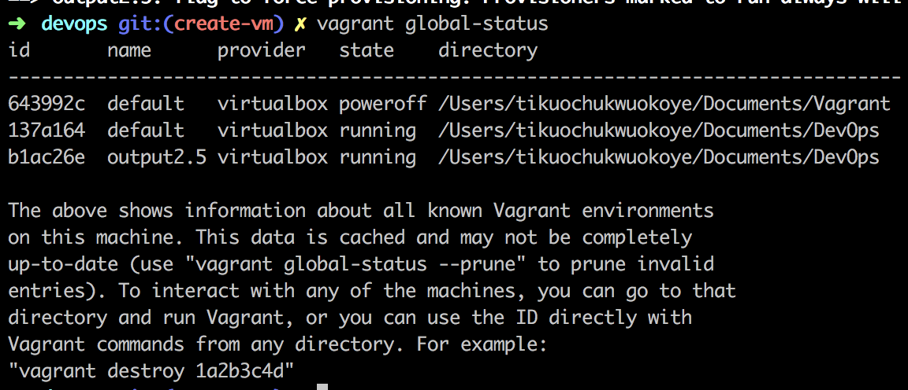

# Building a Virtual machine
## Getting Started

Start by cloning this repo.

```
git clone https://github.com/primuse/DevOps.git
```
After cloning the repo `cd` into it and run `vagrant up` in the terminal to start the virtual machine.


Run `vagrant global-status` to see all virtual machines and to confirm ours is running.



Run `vagrant ssh` to ssh into the virtual machine.


You should see a prompt with this `vagrant@ubuntu-bionic:~$` to show that you are currently in a full-fledged SSH session. You can go ahead and interact with the machine and do whatever you want.

The possibilities are endless.
